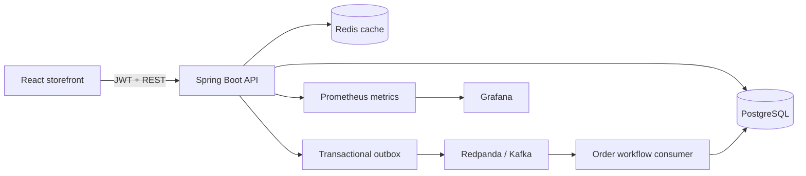
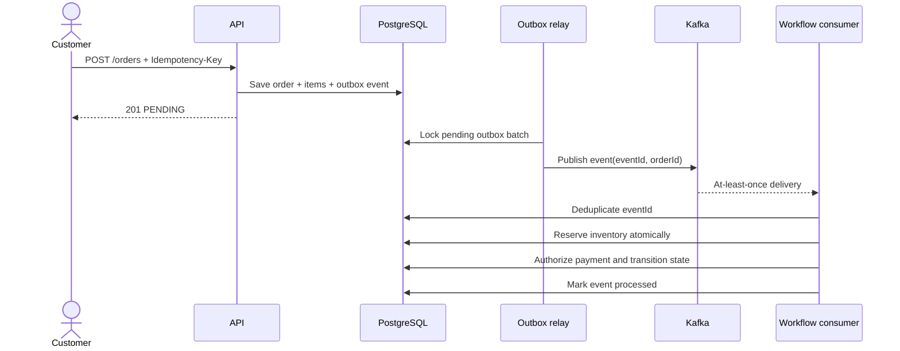

<div align="center">

# OrderFlow

**An event-driven commerce platform built around reliable order processing.**

[](https://github.com/NithishKumar04/orderflow-platform/actions/workflows/ci.yml)
[](https://openjdk.org/projects/jdk/21/)
[](https://spring.io/projects/spring-boot)
[](https://react.dev/)
[](LICENSE)

</div>


OrderFlow is a full-stack storefront whose checkout path is designed as a
failure-aware workflow rather than a CRUD operation. An order is accepted
transactionally, written to an outbox, processed asynchronously, protected
against duplicate delivery, and compensated when payment or inventory fails.

## Engineering highlights

| Concern | Implementation |
| --- | --- |
| Reliable event publication | Transactional outbox with retry budget and dead-letter state |
| Duplicate requests | User-scoped `Idempotency-Key` persisted with a uniqueness constraint |
| Duplicate events | Stable outbox event ID recorded by each idempotent consumer |
| Inventory races | Conditional atomic update plus optimistic entity versioning |
| Partial failure | Explicit state machine and inventory-release compensation |
| Delivery semantics | At-least-once transport with idempotent processing |
| Security | Stateless JWT authentication, BCrypt password verification, validation, CORS |
| Operations | Health probes, Prometheus metrics, correlation IDs, Grafana provisioning |
| Quality | Java integration tests, React unit tests, linting, dependency audit, CI |

## Architecture





See [the architecture deep dive](docs/architecture.md) and
[architecture decisions](docs/adr/) for failure scenarios and tradeoffs.

## Run locally

### Fast path

Requires Java 21 and Node.js 22+. This path uses H2, Caffeine, and an in-process
event transport while preserving the same outbox and consumer contracts.

```bash
# Terminal 1
cd backend
./mvnw spring-boot:run

# Terminal 2
cd web
npm ci
npm run dev
```

Open `http://localhost:5173` and sign in with:

```text
demo@orderflow.dev
Demo123!
```

### Full topology

Requires Docker Compose.

```bash
cp .env.example .env
docker compose up --build
```

The storefront is available at `http://localhost:3000`. The stack includes
PostgreSQL, Redis, Redpanda, the API, and the web application.

Add Prometheus and Grafana:

```bash
docker compose --profile observability up --build
```

| Service | URL |
| --- | --- |
| Storefront | `http://localhost:3000` |
| OpenAPI UI | `http://localhost:8080/docs` |
| Health | `http://localhost:8080/actuator/health` |
| Prometheus | `http://localhost:9090` |
| Grafana | `http://localhost:3001` (`admin` / `orderflow`) |

## Failure paths to try

1. Add a product and choose **Approve payment** to reach `CONFIRMED`.
2. Choose **Decline payment** to see inventory reserved, released, and the
   order move to `PAYMENT_FAILED`.
3. Send the same checkout twice with one `Idempotency-Key`; both responses
   reference the same order.
4. Stop the broker in the Docker topology; the relay retries with exponential
   backoff and moves exhausted events to its dead-letter state.

## Verify

```bash
make verify
```

The command runs backend tests and coverage, frontend linting and unit tests,
and a production web build. GitHub Actions repeats these checks, validates the
Flyway migration against PostgreSQL with Testcontainers, builds the containers,
starts the PostgreSQL/Redis/Redpanda topology, and completes an asynchronous
order on every pull request.

## Repository map

```text
backend/                 Spring Boot API, workflow, migrations, tests
web/                     React + TypeScript storefront
docs/                    Architecture, ADRs, screenshots
ops/                     Prometheus, Grafana, load-test configuration
.github/workflows/       CI pipeline
docker-compose.yml       Full local distributed topology
```

## Deliberate scope

This is a portfolio system, not a claim of internet-scale commerce. It uses one
deployable backend with strict domain boundaries because independent services
would add operational cost without improving this demo's learning signal. The
event transport is replaceable, payment is deterministic and simulated, and
the prepared user is for demonstration only. The design records explain how
those boundaries can be extracted when scaling pressure justifies it.

## More

- [API examples](docs/api-examples.md)
- [Testing strategy](docs/testing.md)
- [Contributing](CONTRIBUTING.md)
- [Security policy](SECURITY.md)
- [Image attribution](docs/ATTRIBUTION.md)
