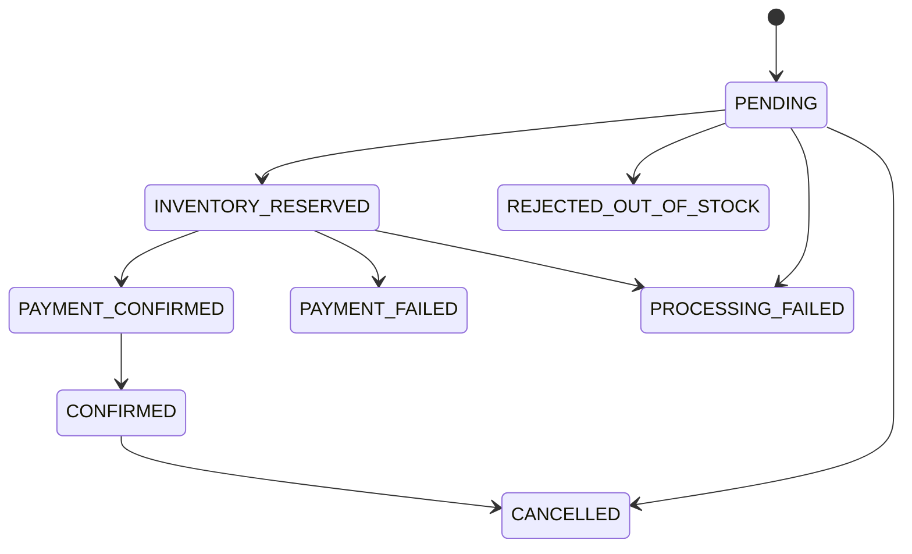

# Architecture

## Goals

OrderFlow is designed to demonstrate the parts of checkout that become
interesting under failure:

- accept an order without losing the event that starts processing;
- tolerate repeated HTTP requests and broker redelivery;
- prevent inventory from becoming negative under concurrency;
- make every state transition explicit and auditable;
- compensate inventory when payment fails;
- remain runnable on a laptop without hiding the production topology.

## Domain boundaries

The backend is one deployable process with four package-level boundaries:

| Module | Responsibility | Owns |
| --- | --- | --- |
| Catalog | Product discovery and cached reads | Products and inventory |
| Order | Checkout, state machine, user order history | Orders and timelines |
| Events | Outbox relay and transport adapters | Outbox and processed events |
| Auth | Prepared-user login and JWT verification | Authentication policy |

This modular-monolith shape keeps transactions and local development honest.
Each boundary exposes a narrow service contract and can later become an
independent deployment without rewriting the workflow model.

## Checkout transaction

`POST /api/orders` performs one database transaction:

1. Look up `(user_id, idempotency_key)`.
2. Validate and merge requested quantities.
3. Snapshot names, SKUs, and prices into immutable order items.
4. Persist a `PENDING` order and its initial timeline entry.
5. Persist the idempotency record.
6. Persist `order.placed.v1` in the outbox.
7. Commit and return `201`.

The API does not publish directly to Kafka. If the process exits after commit,
the event remains in PostgreSQL for another relay attempt.

## Outbox relay

The scheduled relay pessimistically locks a bounded batch of due events. A
transport adapter either:

- invokes the consumer contract directly in the zero-infrastructure profile;
  or
- waits for Kafka acknowledgement in the Docker profile.

Failures increment the attempt count and schedule exponential backoff. Events
that exhaust the configured budget enter `DEAD_LETTER`, and the order enters
`PROCESSING_FAILED`. Operational counters expose publication, retry, and
dead-letter activity.

## Consumer idempotency

The UUID created for the outbox row is serialized into every broker message.
The consumer records that UUID in `processed_events` in the same transaction
as order state changes. Redelivery therefore produces no additional inventory
or payment side effects.

The database uniqueness constraint is the final guard. Broker offsets are not
used as identities because republishing the same event can produce a new
offset.

## Inventory consistency

Reservation is one conditional statement:

```sql
UPDATE products
SET inventory = inventory - :quantity,
    version = version + 1
WHERE id = :productId
  AND inventory >= :quantity;
```

One updated row means reservation succeeded; zero means insufficient stock.
This avoids read-then-write races. Product entities also carry optimistic
versions so conflicting administrative changes fail instead of silently
overwriting one another.

## State machine



Transitions outside this graph are rejected. Timeline rows are written by the
aggregate, so API responses and operational debugging share one source of
truth.

## Compensation

The demo payment adapter has approved and declined paths. A decline releases
every reserved line item before moving the order to `PAYMENT_FAILED`. The
workflow runs in one transaction, so an unexpected exception rolls back both
reservation and order transitions.

In a real external payment integration, authorization cannot share the
database transaction. The next step would be a saga with separately
idempotent inventory, payment, and refund commands.

## Runtime profiles

| Capability | Default profile | Docker profile |
| --- | --- | --- |
| Database | H2 in PostgreSQL mode | PostgreSQL 16 |
| Catalog cache | Caffeine | Redis 7 |
| Event transport | In-process adapter | Redpanda / Kafka |
| Schema | Flyway migration | Same Flyway migration |
| Contract | Outbox + idempotent consumer | Same |

The default profile exists for reviewer accessibility. It does not bypass the
outbox, retry state, event identity, or workflow processor.

## Production hardening

Before operating this for real customers:

- replace prepared-user auth with OIDC and rotating asymmetric keys;
- split inventory and payment into independent ownership boundaries;
- use a managed broker and database with multi-zone recovery;
- add a replay console and alerts for dead-letter growth;
- encrypt secrets through a platform secret manager;
- add trace export and service-level objectives;
- run concurrency, soak, and recovery tests against the deployed topology.
